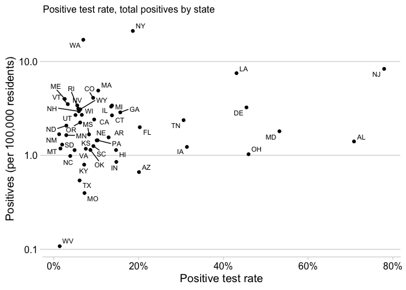
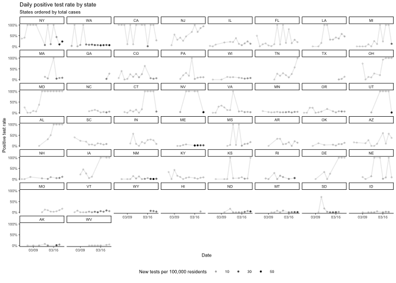
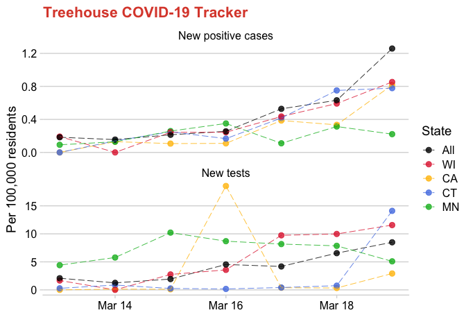
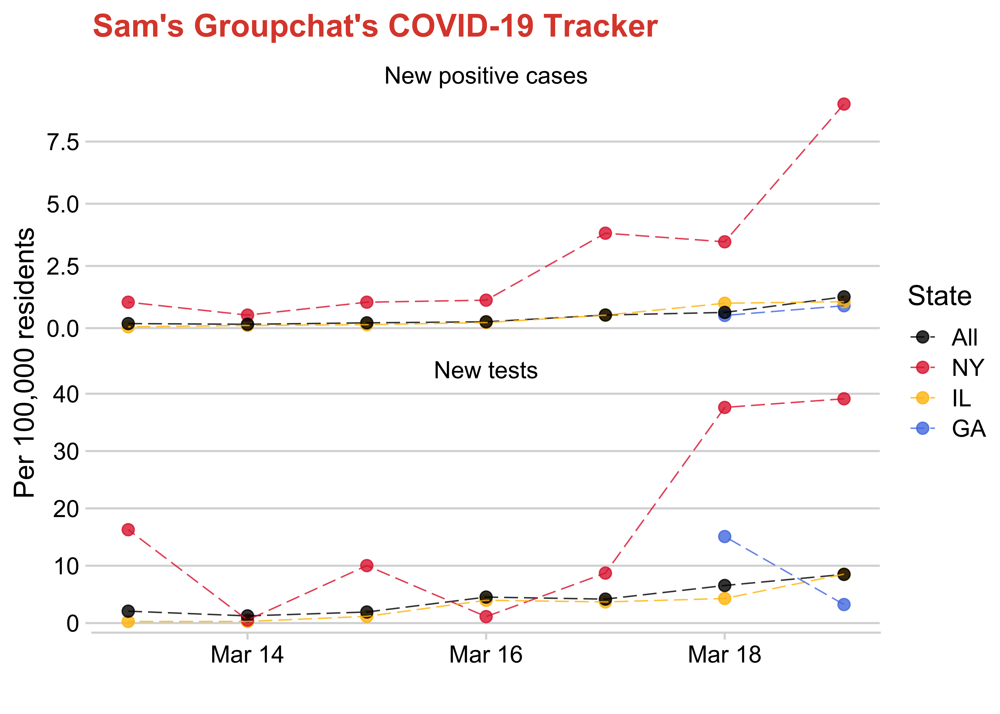
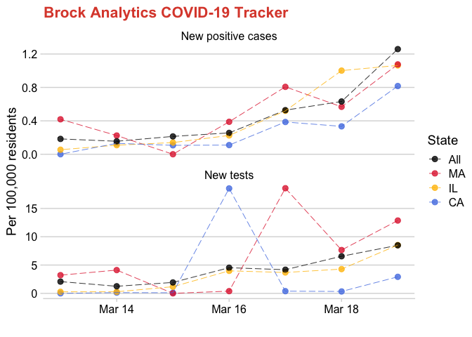

COVID-19
================

# Prepare data

Make a states data frame (populations from 2013)

Download raw covid daily data

Manipulate and clean the data

# Graphs

Positive test rate, total positives by state

# Graphs - By state

