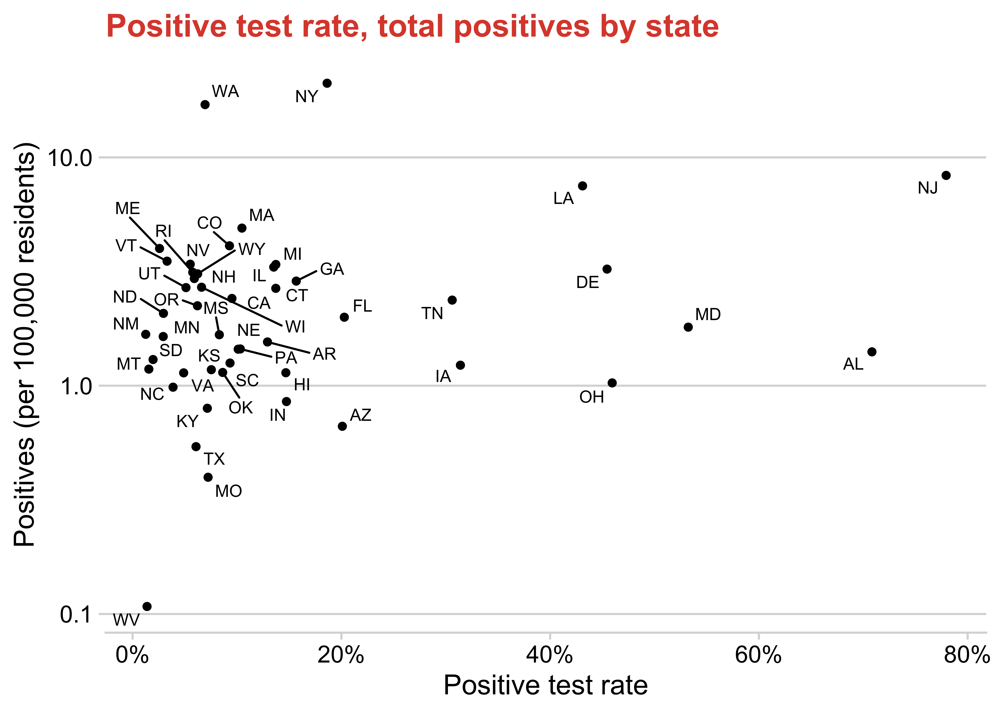
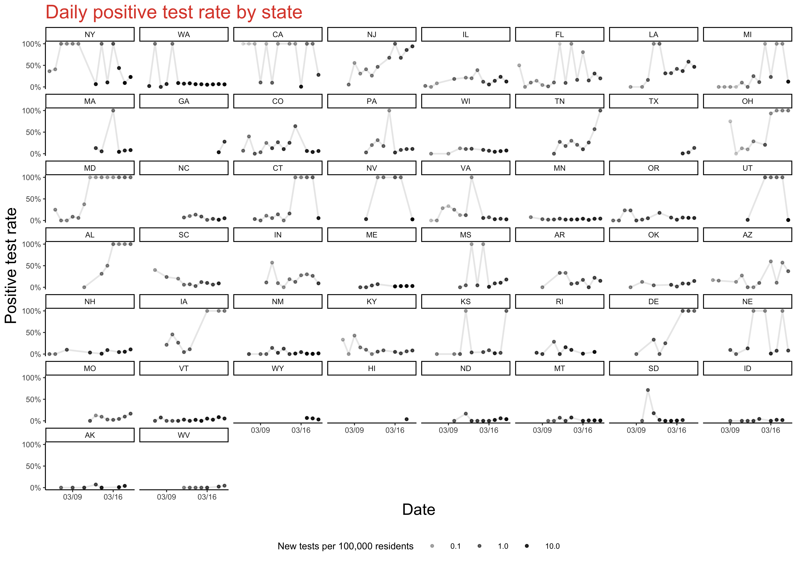
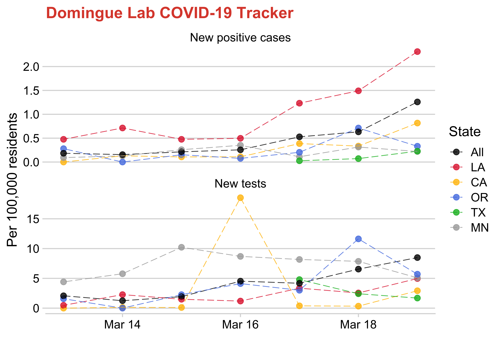
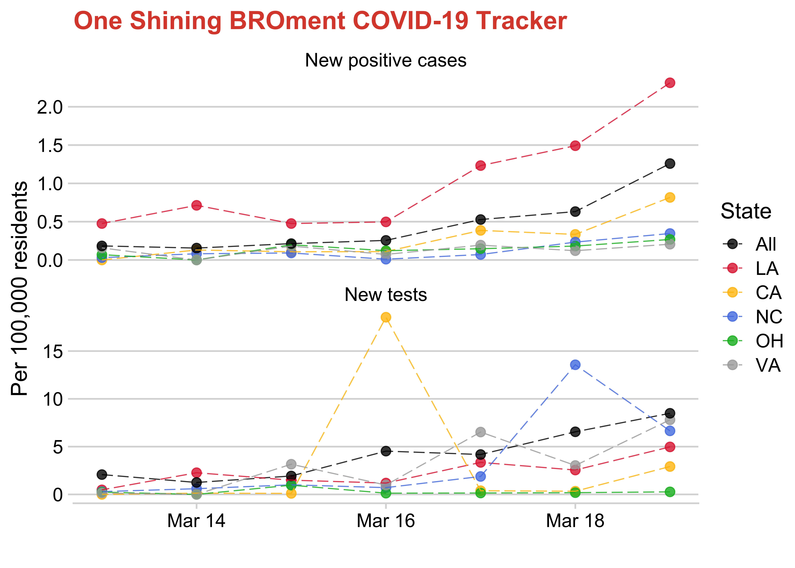

COVID-19
================

# Prepare data

Make a states data frame (populations from 2013)

``` r
states_df <- 
    tibble(
        state = state.abb,
        state_full = state.name
    ) %>% 
    left_join(
        read_csv("https://raw.githubusercontent.com/jakevdp/data-USstates/master/state-population.csv") %>%
            filter(ages == "total", year == max(year)) %>% 
            select(state = 1, pop = 4)
    )
```

    ## Parsed with column specification:
    ## cols(
    ##   `state/region` = col_character(),
    ##   ages = col_character(),
    ##   year = col_double(),
    ##   population = col_double()
    ## )

    ## Joining, by = "state"

Download raw covid daily data

``` r
data_raw <- 
    read_csv("http://covidtracking.com/api/states/daily.csv") %>% 
    mutate(date = date %>% as.character() %>% as_date()) %>% 
    filter(state %in% state.abb) %>% 
    left_join(states_df)
```

    ## Parsed with column specification:
    ## cols(
    ##   date = col_double(),
    ##   state = col_character(),
    ##   positive = col_double(),
    ##   negative = col_double(),
    ##   pending = col_double(),
    ##   death = col_double(),
    ##   total = col_double(),
    ##   dateChecked = col_datetime(format = "")
    ## )

    ## Joining, by = "state"

Manipulate and clean the data

``` r
data <- 
    data_raw %>% 
    arrange(state, desc(date)) %>% 
    mutate(
        positive_per = positive / pop * 100000,
        total = positive + negative,
        total_per = total / pop * 100000,
        rate = positive / total
    ) %>% 
    mutate_if(is.numeric, replace_na, 0) %>% 
    group_by(state) %>% 
    mutate(
        new_positive = positive - lead(positive),
        new_positive_per = new_positive / pop * 100000,
        new_test = total - lead(total),
        new_test_per = new_test / pop * 100000,
        new_rate = new_positive / new_test
    ) %>% 
    ungroup() %>% 
    filter(
        !is.na(new_test),
        new_test >= 0, 
        new_test >= new_positive
    ) %>% 
    mutate(
        state = 
            state %>% 
            fct_reorder(positive, first) %>% fct_rev()
    ) %>% 
    select(
        date, state, pop, 
        positive, total,
        positive_per, total_per,
        new_positive, new_test, new_rate,
        new_positive_per, new_test_per
    )
```

# Graphs

Positive test rate, total positives by state

``` r
data %>% 
    filter(date == max(date)) %>% 
    mutate(rate = positive / total) %>% 
    ggplot(aes(x = rate, y = positive_per, label = state)) +
    geom_point() +
    geom_text_repel(size = 3) +
    scale_x_continuous(labels = scales::percent) +
    scale_y_log10() +
    labs(
        x = "Positive test rate",
        y = "Positives (per 100,000 residents)",
        subtitle = "Positive test rate, total positives by state"
    )
```

<!-- -->

``` r
data %>% 
    filter(new_test >= 3) %>% 
    ggplot(aes(x = date, y = new_rate)) +
    geom_point(size = 0.5, aes(alpha = new_test_per)) +
    geom_path(alpha = 0.1) +
    facet_wrap(~ state) +
    scale_alpha_continuous(breaks = c(10, 30, 50)) +
    scale_y_continuous(labels = scales::percent, breaks = c(0, 0.5, 1)) +
    scale_x_date(date_breaks = "1 week", date_labels = "%m/%d") +
    labs(
        x = "Date", 
        y = "Positive test rate", 
        alpha = "New tests per 100,000 residents",
        title = "Daily positive test rate by state",
        subtitle = "States ordered by total cases"
    ) +
    theme_classic(base_size = 6) +
    theme(legend.position = "bottom")
```

    ## geom_path: Each group consists of only one observation. Do you need to adjust
    ## the group aesthetic?

<!-- -->

# Graphs - By state

``` r
source("R/graph_by_state.R")

graph_covid(
    c("MN", "WI", "CA", "CT"),
    "Treehouse COVID-19 Tracker"
)
```

<!-- -->

``` r
graph_covid(
    c("IL", "GA", "NY"),
    "Sam's Groupchat's COVID-19 Tracker"
)
```

<!-- -->

``` r
graph_covid(
    c("CA", "VA", "NC", "LA", "OH"),
    "One Shining BROment COVID-19 Tracker"
)
```

<!-- -->

``` r
graph_covid(
    c("CA", "IL", "MA"),
    "Brock Analytics COVID-19 Tracker"
)
```

<!-- -->
